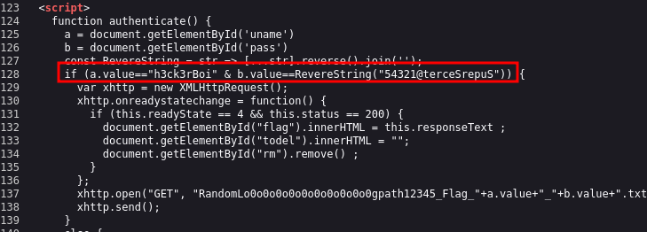

# CyberHeroes CTF - 25.May

<figure><figcaption></figcaption></figure>

***

* Difficulty : <mark style="color:green;">Easy</mark>
* Link : [https://tryhackme.com/room/cyberheroes](https://tryhackme.com/room/cyberheroes)
* Creator : [THMDan](https://tryhackme.com/p/THMDan) -  [cmnatic](https://tryhackme.com/p/cmnatic)  -  [tryhackme](https://tryhackme.com/p/tryhackme)

## 🧠 CyberHeros — TryHackMe Walkthrough

**Difficulty**: Easy\
**IP Address**: `10.10.194.94`\
**Focus Areas**: Web Enumeration, Source Code Analysis.\
**Objective**: Gain access to a login panel using exposed credentials

***

### 🚀 Deploy the Machine

I deployed the machine and began with a standard enumeration process on the IP: `10.10.194.94`.

***

### 🔎 Enumeration

#### 🔹 Full Port Scan

I ran a full TCP port scan to detect all open services:

```bash
nmap -p- -T4 10.10.194.94
```

**Result:**

```
22/tcp open  ssh
80/tcp open  http
```

➤ The system is running an SSH service on port 22 and a web server on port 80.

***

#### 🔹 Version and Script Scan

Next, I performed a detailed scan of the open ports:

```bash
nmap -p22,80 -T4 -A 10.10.194.94
```

**Output Summary:**

```
22/tcp open  ssh     OpenSSH 8.2p1 (Ubuntu)
80/tcp open  http    Apache 2.4.48 (Ubuntu)
  |_http-title: CyberHeros : Index
  |_http-server-header: Apache/2.4.48 (Ubuntu)
```

➤ The site is running Apache on Ubuntu, and the homepage title is "CyberHeros".

***

### 🌐 HTTP Enumeration (Port 80)

#### 🔍 Source Code Analysis

I opened the website in a browser and used **View Page Source** to inspect the underlying HTML. I looked for:

* HTML comments
* Embedded credentials
* Framework clues

I discovered that the site uses a **BootstrapMade** template, which often indicates a **static site with no backend**, meaning all logic and data may be visible client-side.

#### 🔑 Hidden Credentials

In the HTML source, I found a hidden password string that looked like it was reversed:

<div align="left"><figure><figcaption></figcaption></figure></div>

```
<!-- Password: 54321@terceSrepuS -->
```

Reversing it gives:

```
SuperSecret@12345
```

Also in the code, I found the username:

```
<!-- Username: h3ck3rBoi -->
```

***

### 🔐 Login Bypass

I attempted to log in using the credentials found in the source:

* **Username**: `h3ck3rBoi`
* **Password**: `SuperSecret@12345`

✅ **Success!** I was logged in and immediately presented with the first flag.

***

### 🎯 Flag Captured

A flag was revealed upon successful login — proving the vulnerability and validating the source code leak.

***

Want help writing this as a full GitBook chapter or Markdown export for TryHackMe documentation? Just ask!
